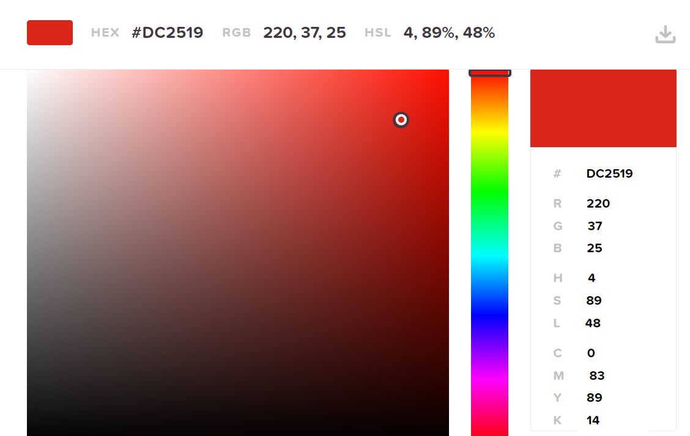

# PORTFOLIO PROJECT - 1

# Taste Of Madinah

#
## PURPOSE

The Taste of Madinah is a website for a restaurant in Madinah, Saudi Arabia that serves Arabian cuisine from Shawarma, biryani and deserts like kunafa. 
Consumers can use this website to see what the menu provides and a brief information about the restuarnt.
The target audience for this website is for anyone that wants to try out the best Arabian cuisines
* [Final project link](https://ahamza98.github.io/taste-of-madinah/)

## Project Goals

### Users Goals
* Dine at an Arabian restaurant in Madinah.
* Go through a menu.
* Know where to find the restaurant, and how to contact the restaurant.
* Go through the menu and see what the prices.
* Be able to give a feedback
* Find the restaurant on social media

### Owners Goals
* customer satisfaction
* Increase in consumers
* Advertise the company

#
## WIREFRAMES

Home

Menu

Get In Touch

#
#

## FEATURES

* The site consists of: 
    * 3 main pages, `HOME, MENU, GET IN TOUCH` 
    * Each page will have the same body layout:
    Logo and Navbar; main content and footer.
#    
## Logo and Navigation Bar :
* 
- The logo and navbar are in all 3 html pages.
- Logo has an icon from fontawesome.com
- They are fully responsive on big screens and tablets
- The logo leads to the home page
- The nav bar has 3 links to home, menu and get in touch pages.
- They all open up to the right page.
- The page the user is currently on is the one underlined.
#
## Footer:
* 
- Footer is feautured is in all 3 pages.
- Footer contains 3 headings of Info, Opening-times and Social Media.
- Info is information on location and phone number.
- Opening-times is when the restuarant is open.
- Social media has links to Twitter, Instagram, Youtube and Facebook pages of the restuarant.
- When hovered over the social media links they turn red.
#
## Main-image of Home
* 
- The background image is of the chefs of the restuarant.
- Has a caption that contrasts with the background.
#
## About us content
* 
- A section of what the resturant sells, its location and when it opened.
- an image to its left with a circle-radius.
- In smaller screens the text is directly above the image in a circle container
#
## Menu page
* 
- A menu page containing images of the food items with prices.
- Each container has an image with heading, paragraph and price.
- The containers were assorted by display: grid;
- Fully responsive on all screen sizes.
- Large screen sizes have 3 columns, tablets have 2 and mobile screen have 1.
- When hovered over the image it has a transition ease-out effect
#
## Get in touch form section
* 
- Get in touch page that has a background image of a dining area.
- A form section to provide feedback
- Form contrasts well with background image.
- Form section has a button of submit.
- Users are required to fill in name, email and feedback before submitting.
#
#
# Design 
## Colours
- The colours in this website revolved around the colour red to symbolise the city of the restuarnt (Madinah) a hot city. And also the food there are known to be spicy like biryani and shawarma.
- Also when hovered over links, they change to red.
- The Menu and Get In Touch header section have the same tone of red as well as every link when hovered upon and submit button on its own.

- The form section has a slight grey touch to it to fit in with the brownish background.

#
## Fonts 
- For headings Playfair Display SC
- For the rest of body Source Sans Pro

#
# Testing
## Manual testing
- Tested on different browsers such as chrome, firefox and Microsoft edge.
- Confirmed all social media links work as well as nav bar links.
- Checked that the form sheet works, as you cannot submit without filling in name, email and some feedback.
#
#
## Validator testing
### Html Validator

- No errors in all HTML pages via  W3C Markup Validation Service.

Home Page

Menu Page

Get in Touch Page

#
### CSS Validator

- No error in CSS coding via W3C Jigsaw CSS Validation Service.

CSS code

#
### Accessibilty
- No errors, alerts and contrast errors via Wave.Webaim.org

Home Page

Menu Page

Get In Touch Page

#
### Performance
- Performance tested by Lighthouse via Chrome Dev Tools

Home Page

Menu Page

Get In Touch Page

#
# Bugs
## Unsolved bugs
- Not fully responsive with phone screens, due to lack of time and not used to dealing with smaller screens 450px and lower.
- Menu page slow due to using display: grid;. 
- Logo, nav bar and headings out of place in smaller screens.

#
# Deployment
* This site was deployed to the Github pages, the steps to deploy:
  * On the Github reprository page, click on settings
  * Go down and click on pages
  * From the source drop-down menu click on Main.
  * Save your reprository
  * From there on the reprository will be saved and uploaded to the server.

# Credits
## Content
- Nav bar, logo, style form, and circle container layout were taken from [Love Running](https://learn.codeinstitute.net/).
- Display: grid; and display: flex; features were taken from [youtube](https://youtube.com/)

## Media
- All images that are seen on the website taken from {pexels}(https://www.pexels.com/).
- Social media icons and logo icon taken from [fontawesome](https://fontawesome.com/)

# Acknowledgement 

- Firstly to Code Institute for their videos and content.
- A big shoutout to the slack team community for their quick responses and patience
- My mentor Mo Shami
- Also Chris Williams 5P for helping me understand media queries better.
